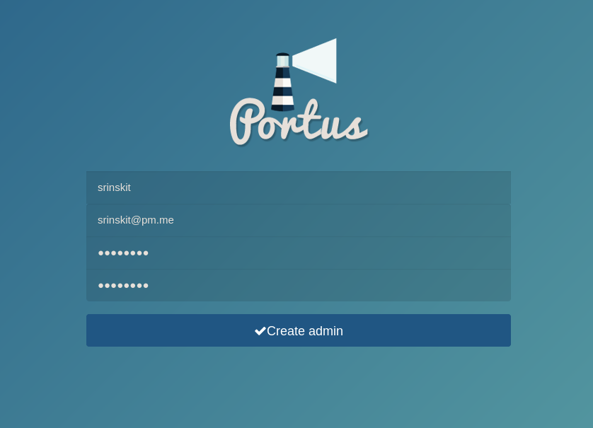
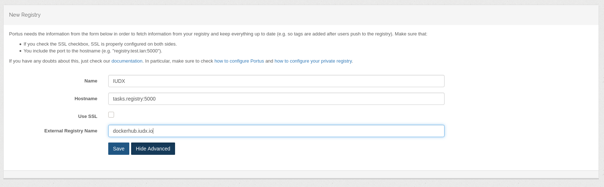
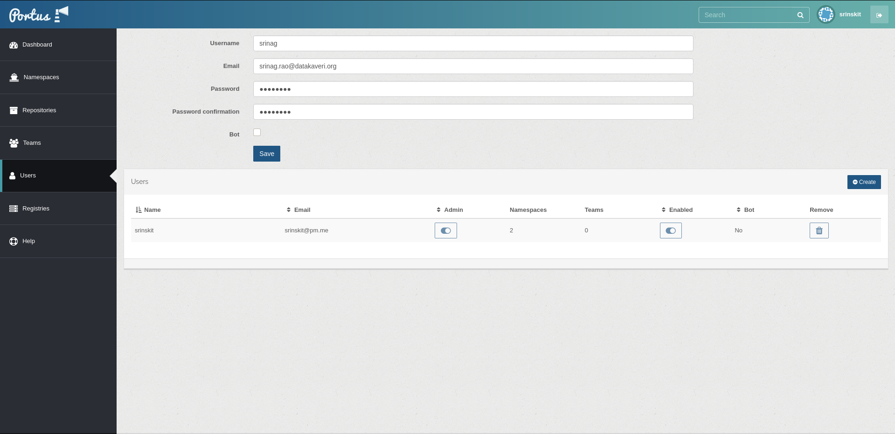
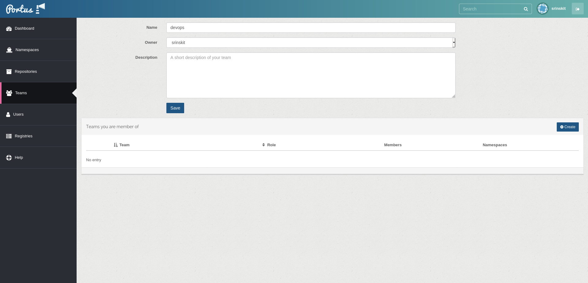
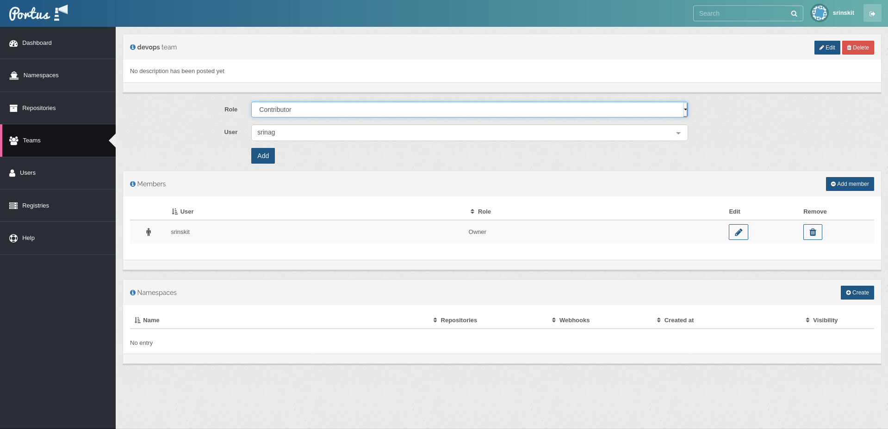
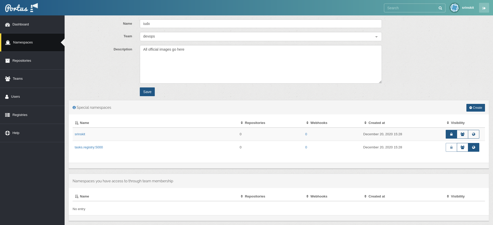

# IUDX Docker Registry

## Deployment
### Environment
```sh
environment
|-- background.env
|-- mariadb.env
|-- portus.env
`-- registry.env
```

### Secrets
```sh
secrets
`-- keys
    |-- portus-auth.cert
    |-- portus-auth.key
    |-- portus.cert
    `-- portus.key
```

### Deploy
```sh
docker stack deploy -c stack.yml docker-registry
```

## ToDo
* Cleanup NGINX configuration
* Add node-labeling incase deployed in non-dedicated cluster

## Notes
* Remember to disable signup in `portus.env` file
* Set visibility for namespaces
* Restart NGINX incase of `Bad Gateway`

## References
1. [Compose file](https://github.com/SUSE/Portus/blob/master/examples/compose)
1. [Portus project](https://github.com/SUSE/Portus)

## Management

### Create admin
On clean boot, you will be prompted to create an admin



### Add registry
On clean boot, you will be prompted to point Portus to the Registry



### Create user


### Create team


### Add user to team


### Create namespace
A team is needed to create a namespace



### Docker
#### Login
```
$ docker login dockerhub.iudx.io 

Username: srinskit
Password: 
WARNING! Your password will be stored unencrypted in /home/srinskit/.docker/config.json.
Configure a credential helper to remove this warning. See
https://docs.docker.com/engine/reference/commandline/login/#credentials-store
Login Succeeded
```

#### Tag
```
$ docker tag alpine:latest dockerhub.iudx.io/srinskit/alpine:latest
```
```
$ docker tag alpine:latest dockerhub.iudx.io/iudx/alpine:latest
```
```
$ docker tag alpine:latest dockerhub.iudx.io/alpine:latest
```
#### Push
##### User namespace
```
$ docker push dockerhub.iudx.io/srinskit/alpine:latest

The push refers to repository [dockerhub.iudx.io/srinskit/alpine]
50644c29ef5a: Pushed 
latest: digest: sha256:a15790640a6690aa1730c38cf0a440e2aa44aaca9b0e8931a9f2b0d7cc90fd65 size: 528
```

##### Team-based namespace
```
$ docker push dockerhub.iudx.io/alpine:latest 

The push refers to repository [dockerhub.iudx.io/alpine]
50644c29ef5a: Mounted from iudx/alpine 
latest: digest: sha256:a15790640a6690aa1730c38cf0a440e2aa44aaca9b0e8931a9f2b0d7cc90fd65 size: 528
```

##### Global namespace
```
$ docker push dockerhub.iudx.io/iudx/alpine:latest    

The push refers to repository [dockerhub.iudx.io/iudx/alpine]
50644c29ef5a: Mounted from srinskit/alpine 
latest: digest: sha256:a15790640a6690aa1730c38cf0a440e2aa44aaca9b0e8931a9f2b0d7cc90fd65 size: 528
```

#### Pull image
```
$ docker pull dockerhub.iudx.io/srinskit/alpine:latest

latest: Pulling from srinskit/alpine
Digest: sha256:a15790640a6690aa1730c38cf0a440e2aa44aaca9b0e8931a9f2b0d7cc90fd65
Status: Image is up to date for dockerhub.iudx.io/srinskit/alpine:latest
dockerhub.iudx.io/srinskit/alpine:latest
```
#### Logout
```
$ docker logout dockerhub.iudx.io                 

Removing login credentials for dockerhub.iudx.io
```